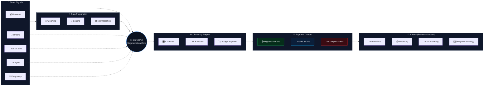

<!-- ===================================================== -->
<!--            FATER Challenge — README.md                -->
<!--     Classy • Interactive • Data Science Portfolio     -->
<!-- ===================================================== -->

<!-- ✅ SAME BRAND BANNER STYLE -->

 

  

<a href="#-project-overview"><b>Overview</b></a> •
<a href="#-business-problem"><b>Business Problem</b></a> •
<a href="#-creative-workflow"><b>Creative Workflow</b></a> •
<a href="#-segmentation-logic"><b>Segmentation</b></a> •
<a href="#-insight-dashboard"><b>Insights</b></a> •
<a href="#-contact"><b>Contact</b></a>

---

## 🏪 Project Overview

The **FATER Challenge** extracts strategic insights from retail store performance data using **analytics + clustering**.  
The goal is to build meaningful store segments and translate them into **clear business actions**.

---

## 💼 Business Problem

Retail teams often need to answer:

- Which stores are consistently high performing?
- Which stores are stable but improvable?
- Which stores need intervention, promotions, or operational changes?

This project uses **unsupervised learning** to discover those patterns.

---

## 🎛️ Creative Workflow

```mermaid
flowchart TB

  %% ===============================
  %%         DATA LAYER
  %% ===============================
  subgraph DATA["📥 DATA FOUNDATION"]
    direction TB
    D0["🧾 Retail Data Ingest"]
    D1["📦 Data Acquisition"]
  end

  %% ===============================
  %%       QUALITY LAYER
  %% ===============================
  subgraph QUALITY["🧼 DATA QUALITY"]
    direction TB
    Q1["🧹 Cleaning<br/>Missing values • Formatting"]
    Q2["📊 Validation<br/>Outliers • Consistency checks"]
  end

  %% ===============================
  %%       ANALYTICS LAYER
  %% ===============================
  subgraph ANALYTICS["🧠 ANALYTICS & FEATURE ENGINEERING"]
    direction TB
    A1["📈 Exploratory Data Analysis"]
    A2["🧩 Feature Engineering<br/>Scaling • Derived Metrics"]
  end

  %% ===============================
  %%       SEGMENTATION LAYER
  %% ===============================
  subgraph SEGMENT["🎯 SEGMENTATION ENGINE"]
    direction TB
    S1["🎛 Optimal K Selection<br/>Elbow • Silhouette"]
    S2["🧮 K-Means Clustering"]
    S3["🏷 Segment Assignment"]
  end

  %% ===============================
  %%       IMPACT LAYER
  %% ===============================
  subgraph IMPACT["🚀 BUSINESS IMPACT"]
    direction TB
    I1["📊 Segment Profiling<br/>Centroids • Behavior"]
    I2["💡 Strategic Insights<br/>Per Segment"]
    I3["🧭 Executive Reporting<br/>Visual Storytelling"]
  end

  %% ===============================
  %%       MAIN FLOW
  %% ===============================
  D0 --> D1 --> Q1 --> Q2 --> A1 --> A2 --> S1 --> S2 --> S3 --> I1 --> I2 --> I3

  %% ===============================
  %%       STYLING (PREMIUM DARK)
  %% ===============================
  classDef data fill:#0B1220,stroke:#60A5FA,stroke-width:2px,color:#E5E7EB;
  classDef quality fill:#1a1022,stroke:#A78BFA,stroke-width:1px,color:#E5E7EB;
  classDef analytic fill:#0F172A,stroke:#23304A,stroke-width:1px,color:#E5E7EB;
  classDef impact fill:#062a1d,stroke:#16A34A,stroke-width:1px,color:#E5E7EB;

  class D0,D1 data;
  class Q1,Q2 quality;
  class A1,A2,S1,S2,S3 analytic;
  class I1,I2,I3 impact;
```

<b>🚀 Retail Intelligence Pipeline — Vertical Strategy Flow (click to collapse)</b>

 

---

## 🧠 Segmentation Logic

<b>🧩 Store DNA — Creative Segmentation Map (click to collapse)</b>

 

---

## 📊 Insight Dashboard (Infographic Style)

<table>
<tr>
<td width="33%" align="center" valign="top">

### 🟢 High Performers
High revenue + strong order volume  
Premium opportunity stores

</td>
<td width="33%" align="center" valign="top">

### 🟡 Stable Performers
Moderate performance  
Optimization candidates

</td>
<td width="33%" align="center" valign="top">

### 🔴 Underperformers
Low metrics  
Strategic intervention required

</td>
</tr>
</table>

---

## 📈 What This Project Demonstrates

<table>
<tr>
<td width="50%" valign="top">

### 📊 Technical Depth
- Data preprocessing  
- EDA & feature engineering  
- K-Means clustering  
- Cluster profiling  
- Visualization & reporting  

</td>
<td width="50%" valign="top">

### 💡 Business Impact
- Store-level segmentation  
- Marketing personalization  
- Inventory planning support  
- Performance anomaly detection  
- Operational resource allocation  

</td>
</tr>
</table>

---

## 🤝 Contact

  
FATER Challenge — retail analytics with actionable segmentation strategy.

